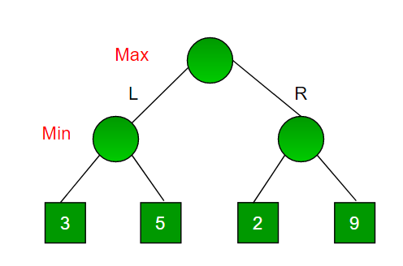

## Min-Max-Algo:

(if you are like "you dude wtf is wrong wid you, tic-tac-toe? seriously?" then know that I just wanted to create a cool program to learn min-max algo, later I might create something cooler like othello or connect4 (FO if you thought chess))

* While you play any game with perfect information every chance a player gets their are several moves the player can play, so consider chess, and you are white, imagine a number line the higher the value the more the favour is on white side and lesser, the black side gets favoured so every move white plays it tries to maximize its value and black tries to minimise inorder to favour its win

* So all in all 0, 2, 4, .....(2n) even moves try to maximize and odd moves minimize

* Now a state can have several moves, so the big picture of a game can be visualised as a tree, let's call the number of valid moves in a state as branching factor, in chess average branching factor is 14, in tic tac toe it's 9 at first then decreases one per move, and with every move the depth increases, the final states are leaf nodes of the tree

now we can backtrack through every possible state and then find the best possible moves

let's take a simple example of game tree with branching factor 2, with nodes where we find the leaf node values with static analysis

here's a pseudo code for baxktracking:

	function minimax(position, depth, maximizingPlayer):

		if depth == 0 or game over in position
			return static evaluation of position
 
		if maximizingPlayer
			maxEval = -infinity
			for each child of position
				eval = minimax(child, depth - 1, false)
				maxEval = max(maxEval, eval)
			return maxEval
 
		else
			minEval = +infinity
			for each child of position
				eval = minimax(child, depth - 1, true)
				minEval = min(minEval, eval)
			return minEval
 
 
// initial call

    	minimax(currentPosition, 3, true)

Now it's all fun and games until you get a game like chess, where the avg branching factor is 14 and the depth is around 120, so number of leaf nodes become 14^120 that's not possible to caculate by any existing system so alpha beta pruning helps here, it elimnates unnecessary tree branches off of search space(just like genocide)

here's a pseudo code for minimax with alpha beta pruning

	function minimax(position, depth, alpha, beta, maximizingPlayer):

		if depth == 0 or game over in position
			return static evaluation of position

		if maximizingPlayer
			maxEval = -infinity
			for each child of position
				eval = minimax(child, depth - 1, alpha, beta false)
				maxEval = max(maxEval, eval)
				alpha = max(alpha, eval)
				if beta <= alpha
					break
			return maxEval

		else
			minEval = +infinity
			for each child of position
				eval = minimax(child, depth - 1, alpha, beta true)
				minEval = min(minEval, eval)
				beta = min(beta, eval)
				if beta <= alpha
					break
			return minEval

	minimax(currentPosition, 3, -∞, +∞, true) //initial call

so you can extrapolate this algo a basic AI for playing several games, othello? chess? connect4? tic-tac-toe? yourlife? you name it!
BTW if you are thinking how practical this idea is then I will leave you with the trivia that, On May 11, 1997, an IBM computer called Deep Blue defeated world champion garry kasparov , and deep blue was basically mini-max + alpha-beta pruning + iterative deepening(some other advanced concept) + loads of parallel computing(ofc you need good hardware).

useful sources:

[MIT_OCW1](https://ocw.mit.edu/courses/electrical-engineering-and-computer-science/6-034-artificial-intelligence-fall-2010/lecture-videos/lecture-6-search-games-minimax-and-alpha-beta/)

[MIT_OCW2](https://ocw.mit.edu/courses/electrical-engineering-and-computer-science/6-034-artificial-intelligence-fall-2010/mega-recitation-videos/mega-recitation-3-games-minimax-alpha-beta/)

[GOOD1](https://www.hackerearth.com/blog/developers/minimax-algorithm-alpha-beta-pruning/)
